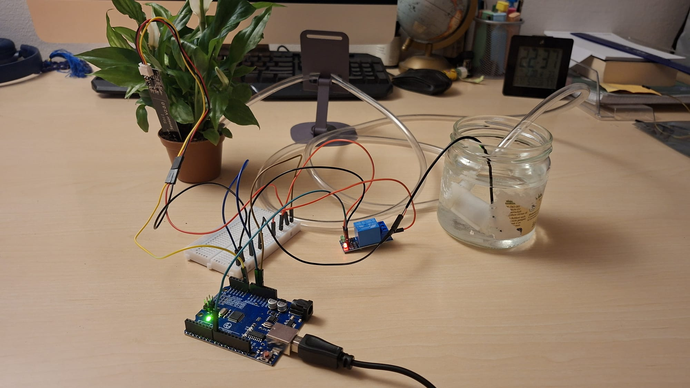

# avr-bare-metal-irrigation
Bare-metal C code for an automated plant waterer, utilizing direct register manipulation on an ATmega328P to control ADC sensors and GPIO relays.

## Project Overview
A closed-loop, automated plant watering system built on an ATmega328P (Arduino Uno R3) utilizing bare-metal C. This project bypasses the standard Arduino hardware abstraction libraries to directly manipulate the microcontroller's memory registers for ADC configuration, GPIO control, and hardware timing.

## Current Status
- [x] Hardware Architecture & Pinout defined
- [x] ADC configured for analog sensor reading
- [x] GPIO configured for relay control
- [x] Main control loop implemented

## Hardware Architecture

### Control Logic (Low Voltage)
* **Microcontroller:** ATmega328P (16MHz)
* **Moisture Sensor:** Analog capacitive/resistive soil sensor
  * `VCC` -> `5V` (Shared Bus)
  * `GND` -> `GND` (Shared Bus)
  * `AOUT` -> `A0` (ADC Channel 0)

### Load Circuit (High Voltage / Actuation)
* **Actuator:** 5V Submersible DC Water Pump (180mA draw)
* **Switching:** 5V Mechanical Relay Module
  * `VCC` -> `5V`
  * `GND` -> `GND`
  * `IN` (Signal) -> Digital Pin `8` (PORTB)

### Engineering Notes: Load Control
The pump is driven by a discrete 5V power rail, switched via a mechanical relay (Normally Open terminal). 
* **Design decision:** While PWM (Pulse Width Modulation) was considered to drop the pump's operating voltage closer to its 4.5V ideal rating, the physical limitations of the mechanical relay (contact degradation/welding at high-frequency switching) precluded this. Instead, a simple binary `HIGH`/`LOW` actuation state is used to drive the pump directly at 5V for short, controlled bursts.
